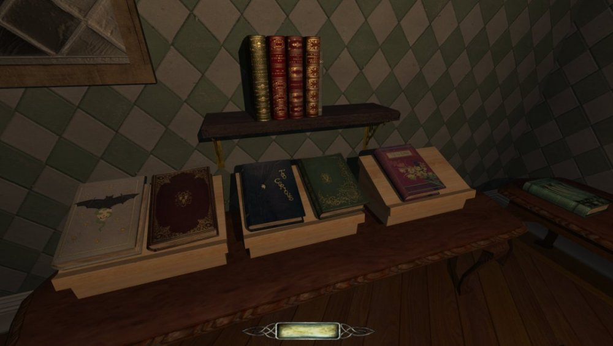

# Public Domain Book Materials Pack

Authors: Amadeus and Bikerdude

All of these books are over 70 years old, some over 150, all of which are Public Domain and/or Creative Commons

pd1-17 - https://publicdomainreview.org/collection/
the-art-of-book-covers-1820-1914/

pd18   - https://w.wiki/HfVf (Chroniques)

pd19   - https://w.wiki/HfVe (Agenoria)

pd21   - https://archive.org/details/lastjournalsofda01livi (public domain)

pd22   - https://w.wiki/HfVc (The_Dutch_in_the_Arctic_Seas)

pd23   - https://w.wiki/HfVa (The home of the blizzard:Australasian Antarctic expedition)

pd24   - https://archive.org/details/traitedelasculta02unse (public domain)
